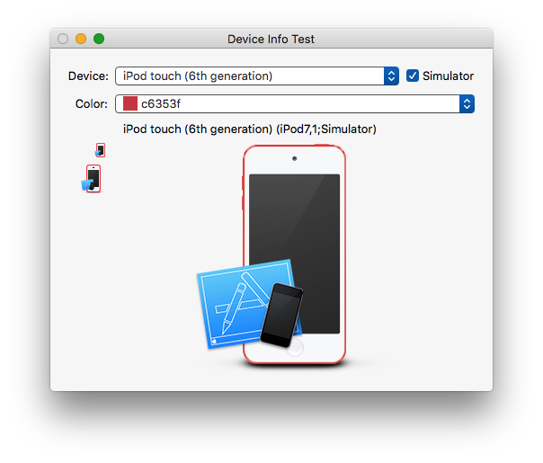

JAAIOSDeviceInfo
================

Cocoa utility to retrieve iOS/watchOS/tvOS device icons

This is a class which allows you to map a device model identifier, like "iPad2,4", and optionally a device color code, to an icon and a name. The icons and names are extracted from the macOS Uniform Type Identifier system. Since the existence of this data is undocumented, it is somewhat fragile, but it’s potentially mildly convenient for custom development and debugging tools that work with iOS devices.

Usage example:
```swift
JAAIOSDeviceInfoManager().icon(forDevice:"iPod7,1" color:"#c6353f") // NSImage?
```

```objc
[[JAAIOSDeviceInfoManager new] iconForDevice:@"iPod7,1" color:@"#c6353f"];
```

Also provided is UIDevice+JAAExtendedDeviceInfo, a category for extracting model identifiers and color codes on device. This has only been tested on iOS.




Copyright © 2013–2016 Jens Ayton

Permission is hereby granted, free of charge, to any person obtaining a copy of this software and associated documentation files (the “Software”), to deal in the Software without restriction, including without limitation the rights to use, copy, modify, merge, publish, distribute, sublicense, and/or sell copies of the Software, and to permit persons to whom the Software is furnished to do so, subject to the following conditions:

The above copyright notice and this permission notice shall be included in all copies or substantial portions of the Software.

THE SOFTWARE IS PROVIDED ”AS IS”, WITHOUT WARRANTY OF ANY KIND, EXPRESS OR IMPLIED, INCLUDING BUT NOT LIMITED TO THE WARRANTIES OF MERCHANTABILITY, FITNESS FOR A PARTICULAR PURPOSE AND NONINFRINGEMENT. IN NO EVENT SHALL THE AUTHORS OR COPYRIGHT HOLDERS BE LIABLE FOR ANY CLAIM, DAMAGES OR OTHER LIABILITY, WHETHER IN AN ACTION OF CONTRACT, TORT OR OTHERWISE, ARISING FROM, OUT OF OR IN CONNECTION WITH THE SOFTWARE OR THE USE OR OTHER DEALINGS IN THE SOFTWARE.
